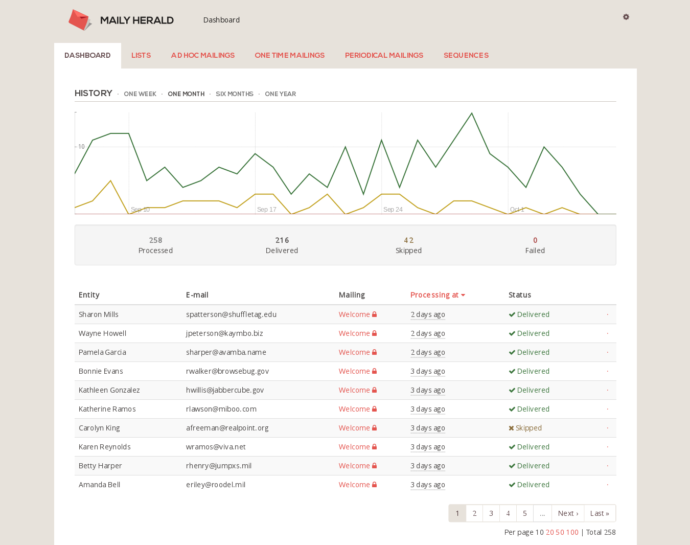

[](https://travis-ci.org/Sology/maily_herald)

# MailyHerald



MailyHerald is a Ruby on Rails gem that helps you send and manage your application mailings. Think of Maily as a self-hosted Mailchimp alternative you can easily integrate into your site. MailyHerald is great both for email marketing and conducting the daily stream of notifications you send to your users.

With MailyHerald you can send:
* ad-hoc mailings - arbitrary emails sent to one or more users at a given point in time (i.e. password reset instructions, special offers, announcements),
* one-time mailings (i.e. account activation, welcome emails),
* periodical mailings (i.e. weekly notifications, reminders),
* mailing sequences - multiple ordered emails delivered with certain delays from a specific point in time (i.e. onboarding emails, site feature overview, reminders).

Maily keeps track of user subscriptions and allows them to easily opt out. You can define who receives which emails and specify conditions that control delivery. All mailing deliveries are scheduled individually for each recipient, tracked and logged.

Maily seamlessly integrates with your app. It can use your regular Action Mailers or you can build email contents with [Liquid](http://liquidmarkup.org/) markup templates.

Core Maily features are accessible for Rails programmers via the API. Apart from that, Maily has a nice Web UI provided by a separate [maily_herald-webui](https://github.com/Sology/maily_herald-webui) gem.

## Requirements

Ruby on Rails 4.2 and 5.1 are supported.

## Installation

Simply just run

    gem install maily_herald

or put in your Gemfile

    gem "maily_herald"

## Features

* Designed for Ruby on Rails
* Self-hosted
* Seamless and flexible integration
* Asynchronous email processing
* Per-recipient delivery scheduling
* Great both for developers (API) and end users (Web UI)
* On-the-fly email templating using [Liquid](http://liquidmarkup.org/) syntax
* Four different mailing types
* User-friendly subscription management i.e. via automatic & personal opt-out links
* Correspondence logging
* Delivery conditions

## Development state

MailyHerald is a relatively young piece of software and it has been deployed in a few different production environments.

If you decide to use it, please tell us what you think about it. You can post some issues on GitHub or email us directly. We're waiting for your feedback.

Here are some things we would like to implement in the future:

* message analytics,
* link tracking,
* fetching bounces from email service (Amazon SES, Mandrill, Sendgrid etc.),
* better templating,
* _put your beloved feature here_.

## How it works

There are a few key concepts that need to be explained in order to understand how Maily works. Some of them are similar to what you might know from other conventional email marketing software. Others come strictly from the Ruby on Rails world.

**Entities**

Entities are your mailing recipients. They will probably be represented in your application by `User` model.

**Mailings**

You usually send single emails to your users, one at a time. Mailing is a bunch of emails sent out to many users. MailyHerald allows you to send four types of Mailings: ad-hoc, one-times, periodicals and sequences.

**Contexts**

Maily Contexts provide a layer of abstraction for accessing collections of entities and their attributes.

There are three main things that Contexts do:

* They define sets of entities via standard Rails scopes (i.e. `User.activated` meaning all application users that activated their accounts).
* They specify destination email addresses for entities (i.e. you can define that `User#email` method returns email address or specify a custom proc that does that).
* They specify additional entity attributes that can be used inside Mailing templates, conditions etc. (essentially, any attribute accessible via Liquid).

**Lists and Subscriptions**

Lists are sets of entities that receive certain mailings. Entities are added to Lists by creating Subscriptions. It is entirely up to you how you manage subscriptions in the application. Typically, you would put a checkbox in the user's profile page which subscribes and unsubscribes them from mailing lists.

Each Subscription has a unique token allowing users to be provided with one-click opt-out links.

**Mailers**

Mailers are the standard way of sending emails in Rails applications. MailyHerald hooks into ActionMailer internals and allows you to send Mailings just like you send your regular emails. All you need to do is inherit `MailyHerald::Mailer` in your Mailer.

There's also a possibility to send Mailings without using any of your custom Mailers. `MailyHerald::Mailer` is in this case used implicitly; email body and subject is stored directly in your Mailing definition as a Liquid template. Liquid gives you access to entity attributes defined in the Context. This way of creating Mailings is especially useful within the Web UI where you can build new Mailing by simply typing in its template.

**Delivery**

MailyHerald uses the great gem [Sidekiq](http://sidekiq.org/) to process deliveries in the background. This applies to all kinds of Mailings - their deliveries are scheduled individually for each entity on the subscription list.

Maily checks periodically for scheduled mailings, and then the time comes, queues them for delivery. This is the job of MailyHerald Paperboy - a tiny daemon that runs in the background and checks the schedules. It is essential to make your mailings work. 

## Usage

Let's assume your entities are your `User` model objects. Read on in order to find out how to get started with Maily.

### Migrations

Install engine migrations and run them.

```ruby
rake maily_herald:install:migrations
rake db:migrate
```

### Defaults (optional)

In some cases, you need to specify default `from` and `host` mailer options in your application in order to ensure proper email rendering:

```ruby
# config/application.rb
config.action_mailer.default_options = { from: "hello@mailyherald.org" }
config.action_mailer.default_url_options = { host: "mailyherald.org" }

```

### Initializer

Generate an initializer:

```ruby
rails g maily_herald:install
```

This will create the following file:

```ruby
# config/initializers/maily_herald.rb
MailyHerald.setup do |config|
  # Put your contexts, mailing definitions etc. here.
end
```

There are few things you need to put there. 

**Set up your context**

Say, for example, you want to deliver your mailings to all your active users:

```ruby
config.context :active_users do |context|
  context.scope {User.active}
  context.destination {|user| user.email}
  
  # Alternatively, you can specify destination as attribute name:
  # context.destination = :email
end
```

**Set up your lists**

The following means that all users in the `:active_users` context scope can be subscribed to the `:newsletters` list.

```ruby
config.list :newsletters do |list|
  list.context_name = :active_users
end
```

MailyHerald lists are opt-in lists. They are empty by default, so make sure to add entities to them, i.e. by using `MailyHerald.subscribe` method.

**Set up your mailings**

```ruby
config.one_time_mailing :hello do |mailing|
  mailing.title = "Hello mailing"
  mailing.list = :notifications
  mailing.mailer_name = "UserMailer"
  mailing.start_at = Proc.new{|user| user.created_at + 1.hour}
  mailing.enable # mailings are disabled by default
end

config.periodical_mailing :weekly_newsletter do |mailing|
  mailing.title = "Weekly newsletter"
  mailing.list = :newsletters
  mailing.mailer_name = "UserMailer"
  mailing.start_at = Proc.new{|user| user.created_at + 1.week}
  mailing.period = 1.week
  mailing.enable
end
```

**Configuration locking**

By default, all contexts, lists and mailings initialized inside `MailyHerald.setup` block are locked and cannot be edited at runtime. This constraint is enforced to maintain the nature of RoR application initializer files. Things set up in the initializer should always be read-only because the initializer is executed every time the application spawns.

If you need to set up mailings programmatically and make them unlocked, don't simply use `MailyHerald.setup`. Instead, use methods from the `MailyHerald` class directly. You can then enter your code, i.e. in a DB seed file or a rake task.

You would typically put your `MailyHerald.setup` block in the Maily initializer file. Keep in mind that this file is evaluated every time Rails boots up, so changes made there (i.e. new mailings added) will be reflected at next application launch.

### Different mailing types

**AdHocMailing** is the most similar to regular Ruby on Rails emails sent using ActionMailer. The only difference is that their delivery is handled by Maily and thus logged and optionally backgrounded. 

**OneTimeMailing** deliveries are performed only once to a single recipient at a scheduled delivery time. It is fully automatic and its delivery can't be manually triggered. OneTimeMailing schedules are created based on the `start_at` attribute individually for each recipient.

**PeriodicalMailing** handles multiple, periodical email deliveries to individual recipients. It is also automatic. Apart from the `start_at` attribute, it also uses a `period` which defines the time distance between consecutive deliveries.

**Sequence** allows you to send multiple different mailings to a given entity with various time delays. It is achieved by defining SequenceMailings associated to a Sequence with delivery delays stored in their `absolute_delay` attributes. A mailing delivery delay is calculated from a point in time defined in Sequence's `start_at` attribute (similar to PeriodicalMailing).

### Procs and Liquid syntax

Mailing attributes such as `start_at` and `conditions` can be defined programmatically as procs or as a string using Liquid syntax. Here's an example of those two cases:

```ruby
# Using Proc:
mailing.start_at = Proc.new{|user| user.created_at + 5.minutes}

# Using Liquid:
mailing.start_at = "user.created_at | plus: 5, 'minutes'"
```

Liquid syntax is obviously more convenient for non-programmers (and can be safely used i.e. in WebUI) but requires some additional setup inside Maily Context. Context attributes available within Liquid templates have to be defined:

```ruby
config.context :all_users do |context|
  context.scope {User.all}
  context.destination = :email
  context.attributes do |user| 
    attribute_group(:user) do
      attribute(:name) {user.name}
      attribute(:email) {user.email}
      attribute(:created_at) {user.created_at}
    end
  end
end
```

Maily provides some Liquid filters that are particularly useful for time manipulation:

* `plus: <number>, '<period>'`
* `minus: <number>, '<period>'`

They can be used for incrementing and decrementing the time value. `<number>` is simply an integer; `<period>` is one of 'minutes', 'hours', 'days' etc.

The Mailing body can also be defined programmatically using custom Mailer. The other way is to not define explicit Mailer but rather set the subject and template as Liquid templates.

```ruby
# Using custom ActionMailer:
config.ad_hoc_mailing :hello do |mailing|
  mailing.list = :all_users
  mailing.mailer_name = "UserMailer" # In this case, you should have a mailer called 'UserMailer' that defines method 'hello'.
  mailing.enable
end

# Using Liquid templates:
config.ad_hoc_mailing :hello do |mailing|
  mailing.list = :all_users
  mailing.subject = "Hello {{user.name}}!"
  mailing.template_plain = "What's up?"
  mailing.template_html = "<h1>What's up?</h1>"
  mailing.enable
end
```

### Mailers

If you want to use your custom ActionMailers with Maily, you need to modify them a bit.

First, each Mailer you want to use with MailyHerald needs to extend the `MailyHerald::Mailer` class. 

Then each Mailer method must be named after the mailing identification name and accept only one parameter, which will be your entity (i.e. `User` class object).

This setup gives you additional instance variables available to you in your views:

* `@maily_entity` - entity you are sending this email to,
* `@maily_mailing` - Mailing you are sending,
* `@maily_subscription` - `MailyHerald::Subscription` object related to this entity and Mailing,

Here's the complete example:

```ruby
class UserMailer < MailyHerald::Mailer
  def hello user
    mail :subject => "Hi there #{user.name}!"
  end
end
```

### Opt-outs

MailyHerald allows entities to easily opt-out using direct unsubscribe urls. Each entity subscription has its own token and based on this token, the opt-out URL is generated.

To process user opt-out requests, you need to mount Maily into your app:

```ruby
# config/routes.rb

mount MailyHerald::Engine => "/maily_herald", :as => "maily_herald_engine"
```

Maily provides you with a URL helper that generates opt-out URLs (i.e. in your ActionMailer views):

```ruby
maily_herald_engine.maily_unsubscribe_url(@maily_subscription)
```

Visiting an opt-out URL disables the subscription and by default redirects to "/". When you use Liquid for email templating, your context will always include the special attribute `subscription` that allows you to easily output unique opt-out URLs. Use the following syntax:

```
{{subscription.unsubscribe_url}}
```

### Email previews

There is an option to view sent email in the browser by the end user. When you use Liquid for email templating, your context will always include the special attribute `log` that allows you to easily output unique email preview URLs based on unique token. Link will be broken in general html template preview (because there is no entity/log specified yet), but when you schedule your mailing this link will be prefilled with correct URL. Use the following syntax:

```
{{log.web_preview_url}}
```

### Delivery and background processing

Scheduled MailyHerald mailings are always sent in the background. 

In order to make your deliveries work, you need to run MailyHerald Paperboy, which will take care of it:

```
$ bundle exec maily_herald paperboy --start
```

Paperboy will monitor your mailing schedules and queue their delivery. The actual sending of emails is handled in the background as a Sidekiq job, so make sure you run Sidekiq alongside Paperboy.

You can't manually trigger delivery of one-time, periodical and sequence mailings. Their schedules and deliveries are maintained automatically.

Ad-hoc mailing, on the other hand, can (and should!) be manually scheduled for delivery:

```ruby
MailyHerald.ad_hoc_mailing(:password_reset).schedule_delivery_to User.first, Time.now
```

Alernatively, for Action Mailer compatibility, you can use the standard syntax for sending emails:

```ruby
UserMailer.password_reset(User.first).deliver
```

This code will process email delivery immediately, in the current thread, just like a regular Action Mailer.

### That's it!

Your Maily setup is now complete.

See [API Docs](http://www.rubydoc.info/gems/maily_herald) for more details about usage and configuration.

## Configuring

You can configure your Maily using the config file `config/maily_herald.yml`. Supported options:

* `verbose`: true,false
* `logfile`: where all the stuff is logged, usually 'log/maily_herald.log`
* `pidfile`: file name
* `redis_url`: string
* `redis_namespace`: string
* `redis_driver`: string

## Other stuff

### Periodical mailing scheduling

Periodical mailing is kind of a special one and has two modes of scheduling: general and individual. If you specify `start_at` as an absolute time, i.e. `"2111-01-01 11:11"`, it goes into general scheduling mode and consecutive mailings will be delivered to all subscribed entities at the same time at every period. This way you can send, for example, weekly newsletters every Monday to all subscribers.

When you specify `start_at` as an individual time, i.e. `"user.start_at"`, individual scheduling mode will be enabled. In this case, delivery periods will count individually for each user and deliveries will be made accordingly.

Individual scheduling mode is the only mode available for all other mailing types.

### Deployments

Maily has a built-in simple support for Capistrano. It supports both v2 and v3 and automates the task of starting, stopping and restarting the Paperboy daemon during deployments.

To enable, just put the following line into your `Capfile`:

```ruby
require 'maily_herald/capistrano'
```

### Opt-out URLs

By default, visiting an opt-out URL silently disables the subscription and redirects to "/". You can easily customize the redirect path by specifying `token_redirect` proc:

```ruby
# Evaluated within config:
config.token_redirect do |controller, subscription|
  # This is just an example, put here whatever you want.
  controller.view_context.unsubscribed_path
end
```

In case you need more customization, you can always overwrite `MailyHerald::TokensController` and its methods:

```ruby
# app/controllers/maily_herald/tokens_controller.rb
module MailyHerald
  class TokensController < MailyHerald::ApplicationController
    before_action :load_subscription, only: :unsubscribe
    before_action :load_log, only: :open

    def unsubscribe
      @subscription.try(:deactivate!)

      redirect_to MailyHerald.token_redirect.try(:call, self, @subscription) || "/", notice: redirection_notice
    end

    def open
      if @log
        @log.data[:opens] = @log.opens.add(request.remote_ip, request.user_agent)
        @log.save
      end

      send_data Base64.decode64("R0lGODlhAQABAPAAAAAAAAAAACH5BAEAAAAALAAAAAABAAEAAAICRAEAOw=="), type: "image/gif", disposition: "inline"
    end

    private

    def load_subscription
      @subscription = MailyHerald::Subscription.find_by_token(params[:token])
    end

    def load_log
      @log = MailyHerald::Log.find_by_token(params[:token])
    end

    def redirection_notice
      @subscription ? t('maily_herald.subscription.deactivated') : t('maily_herald.subscription.undefined_token')
    end
  end
end
```

### Redis namespaces

If you want to use MailyHerald with non-standard Redis namespace, make sure your Sidekiq is also configured properly. This usually involves creating an initializer file:

```ruby
# config/initializers/sidekiq.rb
Sidekiq.configure_server do |config|
  config.redis = { namespace: 'maily' }
end
Sidekiq.configure_client do |config|
  config.redis = { namespace: 'maily' }
end
```

Then make sure you tell Maily about the change:

```yaml
# config/maily_herald.yml
---
:redis_namespace: maily
```

## Contributing

Please aim your pull requests to 'development' branch.

Your changes should be well tested. To set up test environment just run:

```
RAILS_ENV=test rake db:setup
rspec
guard # execute specs interactively
```

## More Information

* [Home Page](http://mailyherald.org)
* [API Docs](http://www.rubydoc.info/gems/maily_herald)
* [Showcase](http://showcase.sology.eu/maily_herald)
* [Sample application](https://github.com/Sology/maily_testapp)

Although we work hard on MailyHerald development, we can't guarantee it is free of bugs. If you find one, please make sure to report it using [issues tracker on Github](https://github.com/Sology/maily_herald/issues). You can also post your feature requests there too.

## License

LGPLv3 License. Copyright 2013-2015 Sology. http://www.sology.eu

Initial development sponsored by Smart Language Apps Limited http://smartlanguageapps.com/
